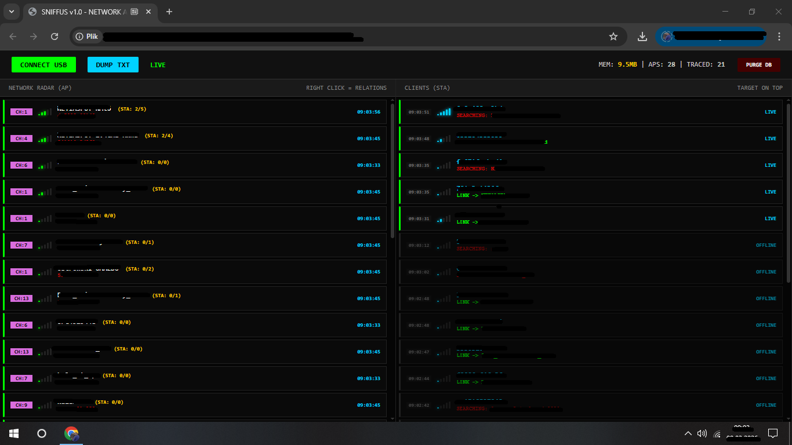
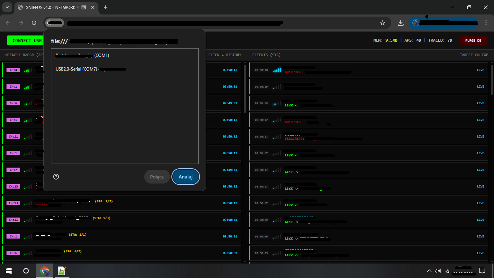
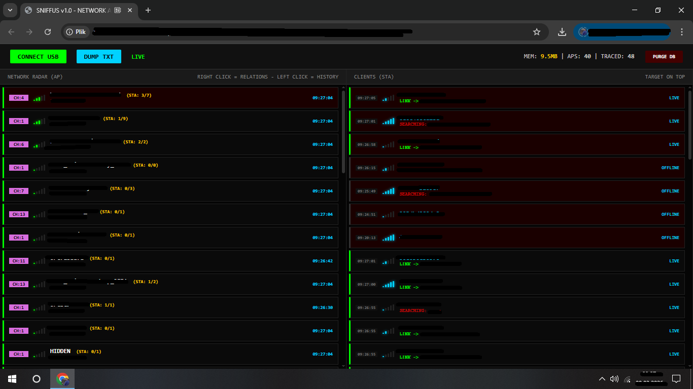
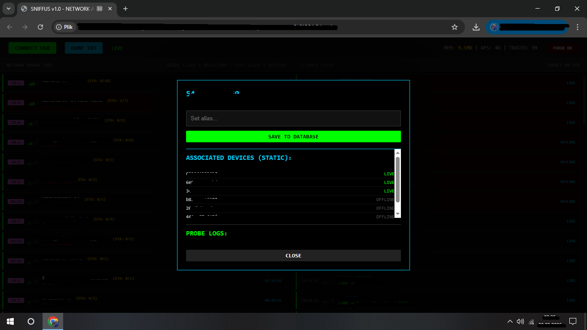
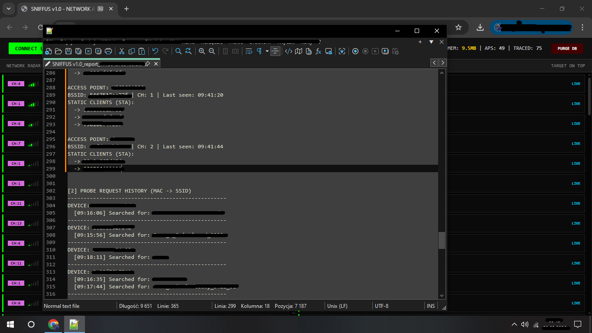

                           SNIFFUS v1.0 - WiFi Network Analyzer

   --SNIFFUS-- is an advanced real-time wireless network analysis tool. It combines the power of the **ESP8266** microcontroller with a modern web interface built on the **Web Serial API**.

--- Key Features

- Promiscuous Mode:** Captures 802.11 packets directly from the air.
- AP Radar:** Detects Access Points along with their channels, signal strength (RSSI), and the number of connected clients.
- Client Tracing (STA):** Monitors client device activity and tracks *Probe Request* history (revealing which networks the device has searched for).
- Static Relationship Mapping:** Automatically links clients to specific Access Points based on traffic analysis.
- Web-based Dashboard:** "Cyberpunk" styled interface that runs directly in your browser—no additional software installation required.
- Data Export:** Allows dumping collected session data into `.txt` files for further analysis.

--- Technical Architecture

    The project consists of two integral parts:
1.  Firmware (ESP8266):** Written in C++ (Arduino Core), utilizing low-level Espressif SDK functions for packet monitoring (monitor mode).
2.  Frontend (Web UI):** A Single Page Application (SPA) built with HTML5, CSS3, and JavaScript. Communication is handled via the **Web Serial API** at a 115200 baud rate.

##  Installation & Setup

--- 1. Flashing the ESP8266

1.  Open the `.ino` source code in the **Arduino IDE**.
2.  Install the ESP8266 board definitions.
3.  Flash the code to your board (e.g., NodeMCU or Wemos D1 Mini).

--- 2. Launching the Dashboard

1.  Open the `index.html` file in a browser that supports the Web Serial API (recommended: **Google Chrome** or **Microsoft Edge**).
2.  Connect your ESP8266 to your computer via USB.
3.  Click the **"CONNECT USB"** button and select the appropriate COM port.

 Disclaimer
SNIFFUS was created for **educational and research purposes only**. The author is not responsible for any misuse of this software. Remember: testing networks that you do not own or do not have explicit permission to test may be illegal.

- Author: rosputinus  
- License: MIT
